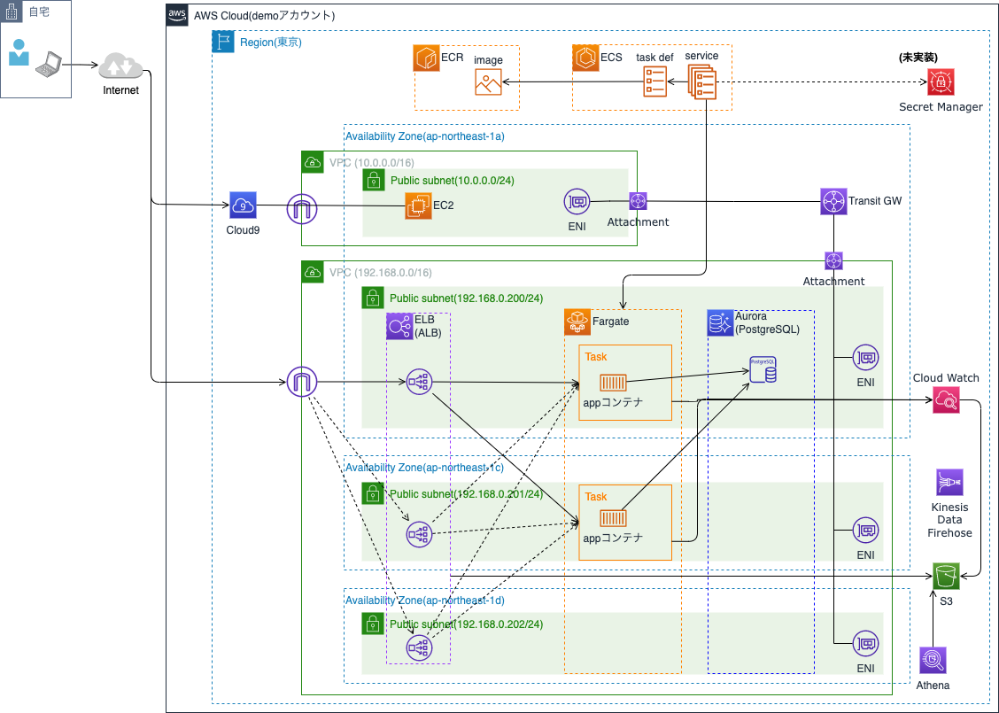

# Seasar2 app container on AWS
* Seasar2アプリのコンテナ化、AWS ECS(Fargate)で動かす
* サンプルアプリに「Seasar2徹底入門」を利用
  * https://www.amazon.co.jp/dp/4798121509
* コンテナ、AWS入門者への説明で、本番適用する際には別途設計は必要。例えば、
  * DB接続情報は「jdbc.properties」にハードコードされている。コンテナ起動時に環境変数など外部から取得するようにする。
  * ログはAWS CloudWatch Logs(awslogs)を利用しているが、OS/ミドルなど多種なログが必要、転送先にS3など利用したい場合は、
    FireLensを使う必要あり。
    * https://aws.amazon.com/jp/blogs/news/under-the-hood-firelens-for-amazon-ecs-tasks/

# システム構成
* DBをH2(デフォルト)からPostgreSQLへ変更



# Projectツリー
一部抜粋。

```
handson:~/environment/seasar2 (main) $ tree
.
├── pom.xml 
├── s2jdbc-gen-build.xml <--- DBへ初期データをマイグレートするantタスク設定
├── docker <--- warアプリをコンテナ化するためのディレクトリ
│   ├── docker-compose.yml
│     ├── Dockerfile
│     └── sastruts-example-0.0.1.war
├── postgres <--- ローカルでDB(PostgreSQL)を起動するためのディレクトリ
│     ├── docker-compose.yml
│     └── Dockerfile
├── src
│     ├── main
│     │     ├── java
│     │     ├── resources
│     │     │     ├── jdbc.dicon
│     │     │     ├── jdbc.properties <--- DB接続先の設定
├── target <--- Mavenでビルドタスク実行(ex. mvn package)で生成される。
│     ├── sastruts-example-0.0.1-sources.jar
│     ├── sastruts-example-0.0.1.war <--- Webコンテナ用(ex. tomcat)アプリ
```

# デモシナリオ
## シナリオ(1): ローカル(Cloud9)上のコンテナで動作確認
.drawio.png)

## シナリオ(2): DBはAWS上に準備。アプリはローカル上のコンテナで動作確認
.drawio.png)

## シナリオ(3): DBはAWS上に準備。アプリもAWSのコンテナオーケストレータ(ECS/Fargate)のコンテナで動作確認DA
.drawio.png)

# Work Logs
## DB(PostgreSQLコンテナ)準備
```
# DB(PostgreSQL)起動
$ pwd
<project_root>/seasar2
$ cd postgres
$ docker compose build && docker compose up

# DBにdemoスキーマ(データベース)作成。pgAdmin(GUI)やpsql(CLI)などクライアントツール利用。
# Amazon Linuxでは、最新のEPEL利用
# https://qiita.com/ajitama/items/59d067a4360d5cb54f05

$ sudo yum install postgresql14.x86_64
$ psql -h localhost -U postgres -d postgres
postgres=# create database demo;

# 後ほどAWS Auroraへ接続する時は↓
# $ psql -h ecs-fargate-demo-aurora-serverless-cluster.cluster-<ランダム>.ap-northeast-1.rds.amazonaws.com -U postgres -d demo

# 宛先をマイグレートしたいDB URLへ変更
# <project_root>/seasar2/src/main/resources/jdbc.propertiesを開き「ローカル用(1)」を選択。
# antタスクでDBマイグレート
$ ant -f s2jdbc-gen-build.xml migrate

# コンテナ終了
$ docker compose stop && docker-compose rm
```

psql操作

```
demo=> \d
             List of relations
 Schema |    Name     |   Type   |  Owner   
--------+-------------+----------+----------
 public | dept        | table    | postgres
 public | dept_id_seq | sequence | postgres
 public | emp         | table    | postgres
 public | emp_id_seq  | sequence | postgres
 public | schema_info | table    | postgres
(5 rows)

demo=> select * from emp;
 id | emp_no | emp_name | mgr_id |  hiredate  |   sal   | dept_id | version_no 
----+--------+----------+--------+------------+---------+---------+------------
  1 |   7369 | SMITH    |     13 | 1980-12-17 |  800.00 |       2 |          1
  2 |   7499 | ALLEN    |      6 | 1981-02-20 | 1600.00 |       3 |          1
  3 |   7521 | WARD     |      6 | 1981-02-22 | 1250.00 |       3 |          1
  4 |   7566 | JONES    |      9 | 1981-04-02 | 2975.00 |       2 |          1
  5 |   7654 | MARTIN   |      6 | 1981-09-28 | 1250.00 |       3 |          1
  6 |   7698 | BLAKE    |      9 | 1981-05-01 | 2850.00 |       3 |          1
  7 |   7782 | CLARK    |      9 | 1981-06-09 | 2450.00 |       1 |          1
  8 |   7788 | SCOTT    |      4 | 1982-12-09 | 3000.00 |       2 |          1
  9 |   7839 | KING     |      0 | 1981-11-17 | 5000.00 |       1 |          1
 10 |   7844 | TURNER   |      6 | 1981-09-08 | 1500.00 |       3 |          1
 11 |   7876 | ADAMS    |      8 | 1983-01-12 | 1100.00 |       2 |          1
 12 |   7900 | JAMES    |      6 | 1981-12-03 |  950.00 |       3 |          1
 13 |   7902 | FORD     |      4 | 1981-12-03 | 3000.00 |       2 |          1
 14 |   7934 | MILLER   |      7 | 1982-01-23 | 1300.00 |       1 |          1
 
 demo=> UPDATE emp SET emp_name = 'takumi' WHERE id=1;
UPDATE 1

demo=> select * from emp where id=1;
 id | emp_no | emp_name | mgr_id |  hiredate  |  sal   | dept_id | version_no 
----+--------+----------+--------+------------+--------+---------+------------
  1 |   7369 | takumi   |     13 | 1980-12-17 | 800.00 |       2 |          1
(1 row)

demo=> \q #psql終了

```

### アプリビルド
```
$ pwd
<project_root>/seasar2

# <project_root>/seasar2/src/main/resources/jdbc.propertiesを開き「ローカル用(2)」を選択。

# maven-2.2.1を利用
# ローカルレポジトリ用下記設定(settings.xml)
$ cat ${user.home}/.m2/settings.xml
<?xml version="1.0" encoding="UTF-8"?>
<settings xmlns="http://maven.apache.org/SETTINGS/1.0.0"
          xmlns:xsi="http://www.w3.org/2001/XMLSchema-instance"
          xsi:schemaLocation="http://maven.apache.org/SETTINGS/1.0.0
                              https://maven.apache.org/xsd/settings-1.0.0.xsd">
  <mirrors>
    <mirror>
      <id>my-mirror</id>
      <name>My Central Mirror</name>
      <url>https://repo.maven.apache.org/maven2</url>
      <mirrorOf>central</mirrorOf>
    </mirror>
  </mirrors>
</settings>

# アプリビルド & warを移動(コピー)
$ rm -rf target && \
  mvn package -DskipTests=true && \
  cp ./target/sastruts-example-0.0.1.war ./docker
```

### アプリローカル起動(コンテナ)
```
# ローカルでアプリ起動
$ pwd
<project_root>/seasar2

% cd docker
% docker compose build && docker compose up

# ブラウザでアクセス
http://localhost:8080/sastruts-example-0.0.1
# GUIで確認したい場合は、Cloud9のPreviewを使っても良い(ポート8080は省略可)。

# コンテナ終了
$ docker compose stop && docker-compose rm
```

### AWS用コンテナビルド&イメージプッシュ
```
$ pwd
<project_root>/seasar2

# <project_root>/seasar2/src/main/resources/jdbc.propertiesを開き「AWS用」を選択。

$ rm -rf target && \
  mvn package -DskipTests=true && \
  cp ./target/sastruts-example-0.0.1.war ./docker

$ cd docker
$ export AWS_ACCOUNT_ID=<your AWSアカウント>
$ aws ecr get-login-password --region ap-northeast-1 | docker login --username AWS --password-stdin ${AWS_ACCOUNT_ID}.dkr.ecr.ap-northeast-1.amazonaws.com
$ docker build -t demoimage .
$ docker tag demoimage:latest ${AWS_ACCOUNT_ID}.dkr.ecr.ap-northeast-1.amazonaws.com/demoimage:latest
$ docker push ${AWS_ACCOUNT_ID}.dkr.ecr.ap-northeast-1.amazonaws.com/demoimage:latest
```

# その他
環境の一部(VPC/Aurora/ECS)をTerraform(provisioningディレクトリ)で作成。
但し、その後手動であれこれ修正・追加しているので(構成ドリフト大)である点に注意が必要で、Terraformはご参考程度。
AuroraもServerless版を別途手動で作り直している。